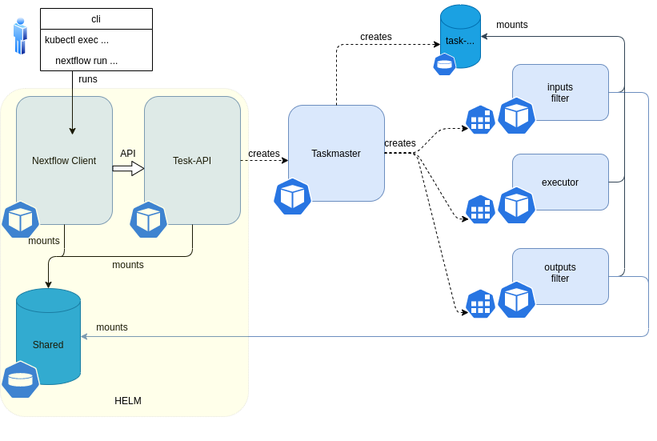

# Hello World in NextFlow and TESK

This is a Helm chart plus some instructions to send a hello world job from Nextflow to TESK. TESK is a kubernetes application. Nextflow is deployed as a command line application inside a Pod. This is so we can set up a shared volume between the two (Nextflow and TESK). For this example the shared volume is not necessary, but it will be necessary for more advanced cases that use any kind of inpiut data.

## Design



The Helm chart provided creates, a Nextflow deployment, a Tesk-API deployment, and a common shared volume. The user will use `kubectl cp` and `kubectl exec` to copy files and enter into the "terminal" of the nextflow pod. When a task is run, Nextflow will contact the TESK api to create it. The TESK API will create a taskmaster and a task shared volume. The inputs filter copies the data files required by the workflow to the task shared volume. The executor(s) pod will read and write files from that shared volume to run thw workflow. Finaly the outputs filter copies the files to the destination speficied by the workflow. The input filer can copy files from a local volume (like in this example), from FTP, or from S3.

The Nextflow image uses a binary built with GA4GH support using `make packGA4GH`. 

## Quick start

In order to deploy this, one needs a Kubernetes namespace and Helm.

* First install the chart

```sh
helm install test-tesk-cineca deployment
```

* Then Exec into the pod and run the hello world

```sh
kubectl exec -it nextflow-client-1-c85qm sh
```

```sh
nextflow run /tmp/nf/hello.nf -with-docker centos
```

## Limitations

This chart has been only tested in OpenShift. There is nothing that will prevent it to run in kubernetes. In order to make it work in Kubernetes, change  `tesk > clustertype` in `values.yaml`.

## Troubleshooting

If you find any problem, create a ticket in this repository.
